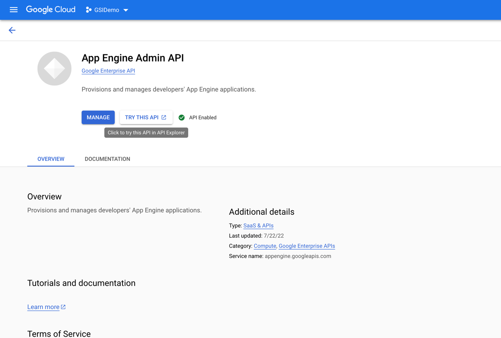
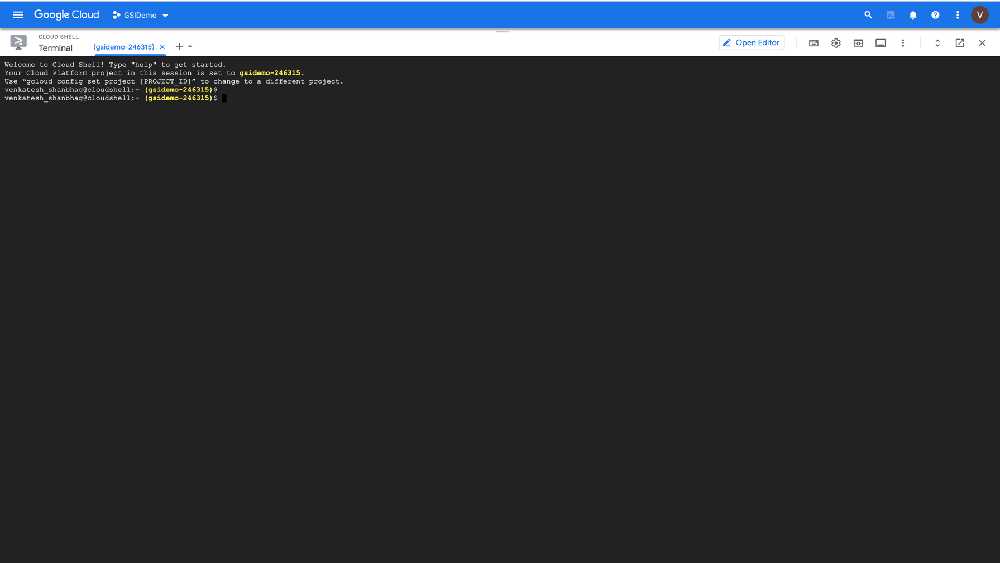
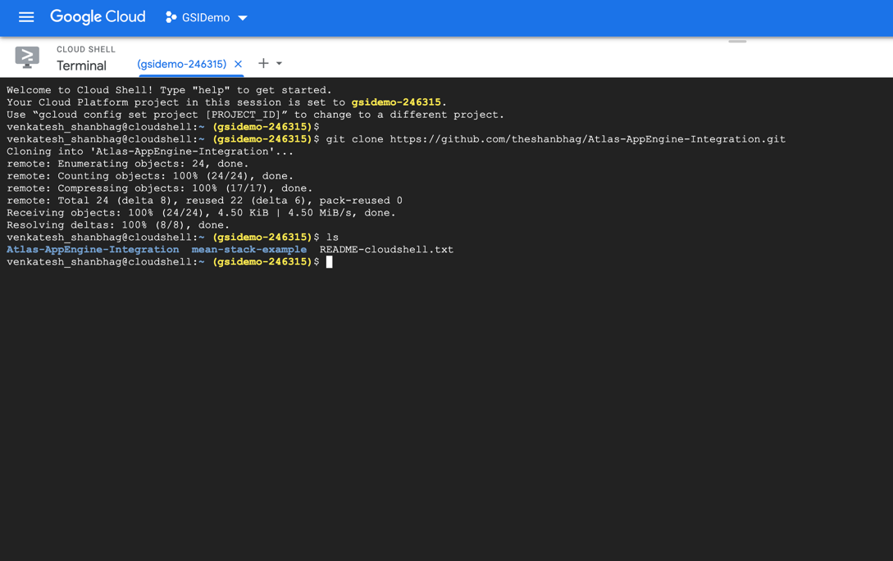
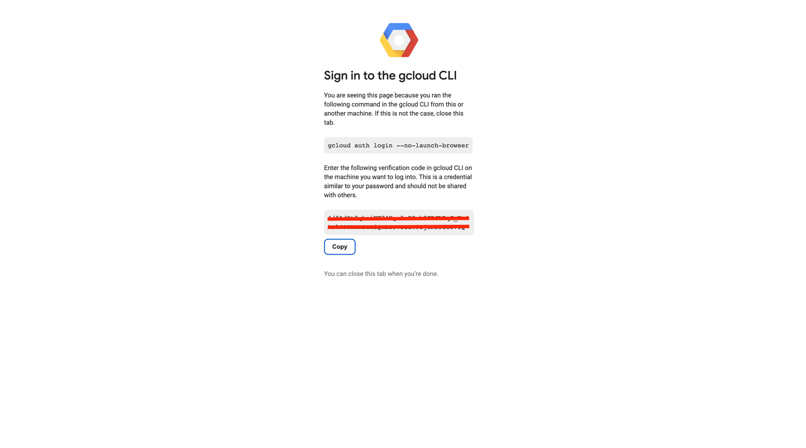
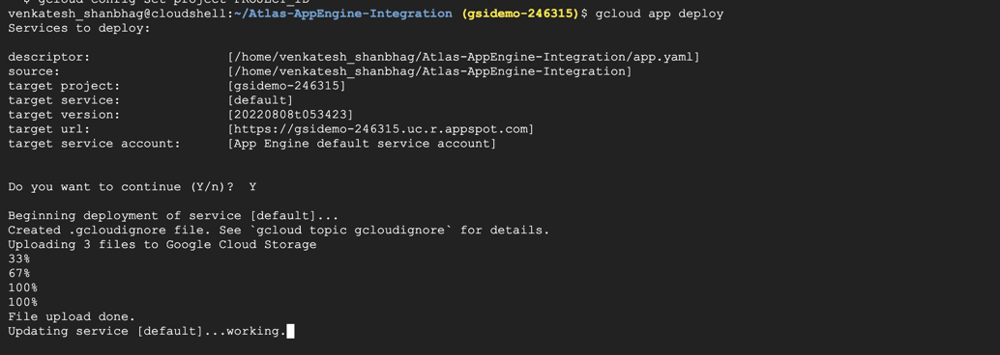
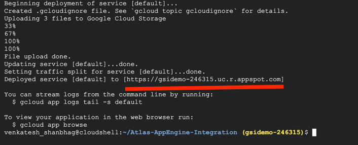
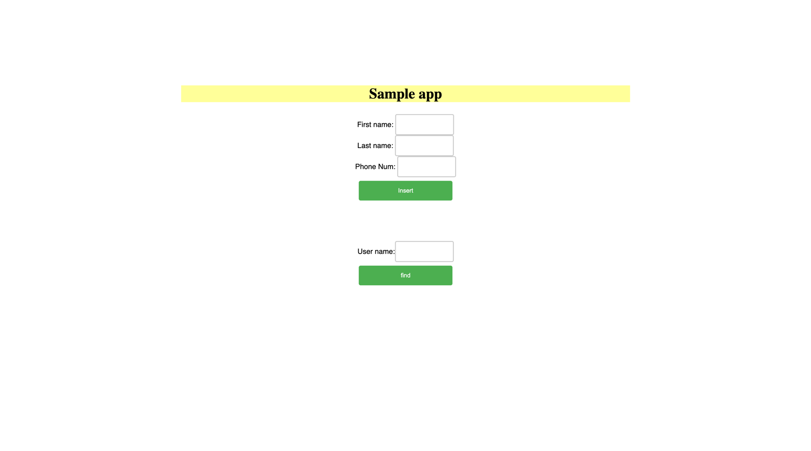

# Speed up your development with - _**Atlas + GCP App Engine**_

## Quickstart: 
This lab will help you to understand how easily we can deploy any application on App engine that can connect to MongoDB using mongodb drivers. 


### 1. Configure Atlas Environment
* Log-on to your Atlas account (using the MongoDB SA preallocated Atlas credits system) and navigate to your SA project
* In the project's Security tab, choose to add a new user called main_user, for this user select Atlas Admin Role from built in roles section (make a note of the password you specify)
* Create an M0 based 3 node replica-set in a single AWS region of your choice with default storage settings (backup can be disabled).
* Navigate to Database Access tab and create new user with read and write permission to any cluster.
* Navigate to Network security tab and Whitelist all ips.
* Navigate to connect on your cluster and copy the connection string.


### 2. Google cloud setup

As we run the Application on Google App engine we need to enable the Google App engine API.



* Once the API is enabled we will set up the gcloud utility tool on the local machine.

* Open Cloud shell on google cloud console.




* Clone this repository on the Cloud terminal using below command.
 ```git clone https://github.com/theshanbhag/Atlas-AppEngine-Integration.git```



* Before you run the application on App engine you need to authorize. 
* Run ```gcloud auth login```. Click on the URL as shown in below image.

* The URL will redirect to google authorization. once successful, you will be able to see verification code as shown below.



* Once All the above steps are complete we will navigate inside the cloned repo.
```cd Atlas-AppEngine-Integration/```
* Update the MongoDB URI in your config.txt file.
```vi config.txt```

* Finally deploy the application using:
```gcloud app deploy```



### Verification

* The app can be accessed from the link generated from last step.



* Open the link in new browser tab.



* Create new entries in the sample App to verify the data is being written to MongoDB.

* Navigate to Atlas and see if the data is being written to MongoDB.
